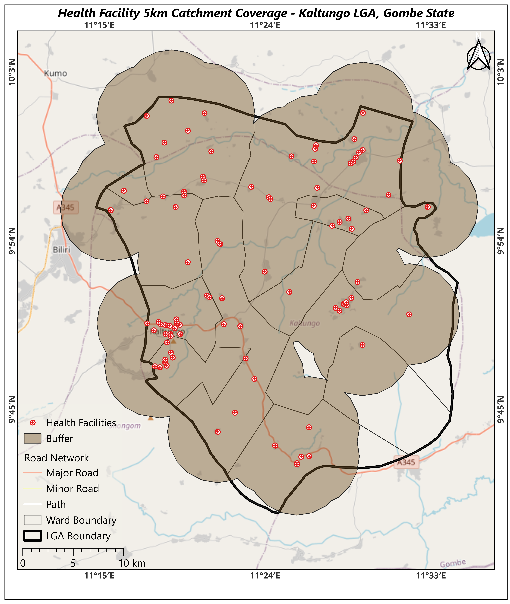

# Month 1 Spatial Analysis Summary

## Restated Question
Which populated wards and settlements in Kaltungo LGA, Gombe State have poor access to health facilities based on spatial distribution and travel distance?

## Operation Ran and Justification
* **Operation:** 5 km Buffer around Health Facilities using EPSG:32632 (UTM Zone 32N).
* **Why:** To create a standard physical coverage baseline identifying areas located beyond the standard 5 km physical reach of health services prior to applying road network routing.

## Expected vs. Actual Results
* **Expected:** 107 buffer polygons that will not cover Kaltungo LGA fully
* **Actual:** 107 buffer polygons generated. Visual inspection shows heavy buffer overlap in central Wards, leaving peripheral regions of the LGA uncovered.

## Four-Way Verification Results
1. **Map Inspection:** Buffers align correctly over health facility points.
2. **Row Count Check:** Output buffer layer contains 107 features, matching the input facility count.
3. **Hand Verification:** Measured radius from facility point to buffer edge is exactly 5,000 meters.
4. **Empty Geometry Check:** Verified 0 NULL or empty geometries in the output attribute table.

## Surprises & Data Still Needed
* **Surprises:** High clustering of health facilities in central Wards causing heavy buffer overlap. Buffers where dissolved so that the final map will not be congested
* **Data Still Needed:** Road network dataset analysis for shortest-path routing and population raster/point data to quantify exact unserved populations.